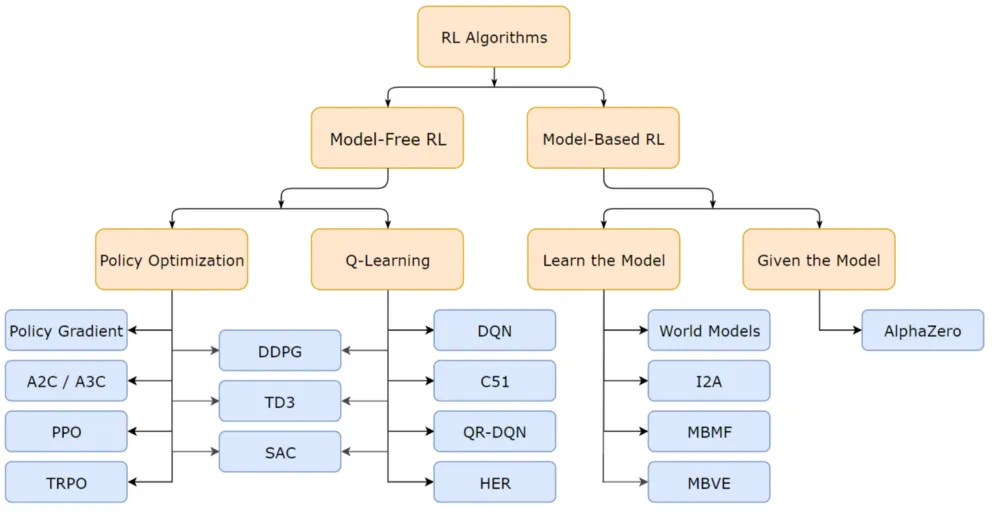

# Reinforcement Learning

Below is the reinforcement Learning taxonomy as defined by OpenAI ([source](https://spinningup.openai.com/en/latest/spinningup/rl_intro2.html)):

In the model-based RL approach, the agent learns both the reward function and the transition probabilities, enabling it to simulate future states and plan accordingly. The added complexity and improved efficiency make it a more advanced topic than model-free approaches, which we will discuss in the future instead.

Below, we start with the model-free RL Q-learning approach on classic problems: (1) Gridworld and (2) Cart Pole.

## GridWorld
### Problem Statement:
In an n x n grid, there exists an agent, blocks, and bombs. The agent has four possible actions in each state (up, down, left, right), but the actions are unreliable. If the direction of the movement is blocked, the agent remains in the same grid square. The grid squares with the gold and the bomb are terminal states. Compute the best policy for finding the gold in as few steps as possible while avoiding the bomb. Compare the results from MDP vs. Q-learning.

### Formula for MDP and Q-Learning
This reinfrocemnt learning problem can be defined by `(S, A, P, R, γ)`, where `S` is the set of states, `A` as the set of actions, `P(s' | s, a)` the transition probability function, `R(s, a)` the reward function, and `γ` the discount factor of future reward. 

Other symbols used below include `π(a|s)` as the policy (the probability of choosing action a in states s), `V(s)` as the function value (expected long-term reward after taking action a in state s), and `Q(s,a)` as the action-value function (expected long-term reward after taking action a in state s), and `α` as the learning rate.

In the two approaches suggested in the prompt, the **MDP** (Markov Decision Process; off-line learning) solve the problem using Value Iteration or Policy Iteration, while the **Q-learning** (model-free; on-line learning) learn the policy through exploration and reward.

More specifically, in **MDP**, the agent iteratively updates the value of each state `V(s)` by:
$$
V(s) \leftarrow \max_a \sum_{s'} P(s' | s, a)[R(s,a) + \gamma V(s')]
$$.
This update continues until the value function converges to the optimal values, after which the optimal action at each state is that which maximize the expected return. Alternatively, MDP can also be solved with policy iteration, where the policy updated with:
$$
\pi'(s) \leftarrow \arg \max_a \sum_{s'} P(s'|s,a)(R(s,a,s') + \gamma V^\pi (s')),
$$
until the policy converges. 

Generally, value iteration is preferred when the state space is relatively small, and direct updates to the value function are simpler and more intuitive, while policy iteration is preferred when the policy evaluation can be performed efficiently, or when the state space is large and value iteration is costly. 

**Q-learning**, on the other hand, focuses on learning the action-value function `Q(s,a)` and updates it by:
$$
Q(s_t, a_t) \leftarrow Q(s_t, a_t) + \alpha [R(s_t, a_t) +\gamma \max_{a'} Q(s_{t+1}, a') - Q(s_t, a_t)],
$$
usually for a fixed number of episodes.

Unlike MDPs, **Q-learning doesn't need the transition probabilities `P(s'|s,a)`, as it directly learns from interactions.** Additionally, MDPs use a convergence threshold since they operate on a known model and update values until they no longer change significantly. In contrast, Q-learning typically uses a fixed number of episodes because it learns from interactions and does not have a clear convergence criterion due to the stochastic nature of exploration. **Or when reward converge?** 